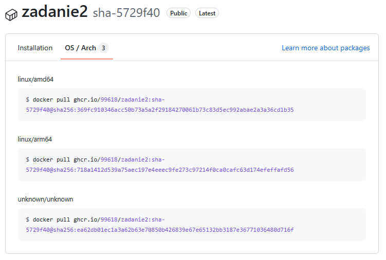

# Sprawozdanie z zadania 2

## Przyjęty sposób tagowania obrazu
Wybrałem tagowanie po SHA aby zagwarantować łatwość weryfikacji wersji obrazu i kodów źródłowych po hashu commita wywołanego 
przez workflow, oraz unikalność w przeciwieństwie do :latest gdzie może zostać napisany obraz i dalej nazywać się :latest.
W dodatku dla jeszcze skuteczniejszego określenia utworzenia obrazu wykorzystałem label (org.opencontainers.image.created).
Źródła:
[Docker best practices](https://www.docker.com/blog/docker-best-practices-using-tags-and-labels-to-manage-docker-image-sprawl/)
[Docker image tagging](https://dev.to/kalkwst/docker-image-naming-and-tagging-1pg9)

## Przyjęty sposób tagowania cache
Cache wartsw builda przechowuje na publicznym repozytorium DockerHub (s99618ren/zadanie2:cache), używam więc tag :cache aby
jednoznacznie poinformować że to repozytorium służy tylko do przechowywania warstw cache.

## Wybór Docker Scout
Wybrałem go ze względu na szybkość i łatwość użycia (nie trzeba go instalować ani konfigurować jak Trivy). 
W dodatku ma bardzo dobrą kompatybilność z GHActions jako oficjalne narzędzie Dockera.

## Krótki opis wykonaych etapów zadania
- skonfigurowano workflow GHActions do budowania obrazów Docker dla architektur amd64 i arm64
- ustawiono cache warstw builda z publicznego repozytorium na DockerHub w celu przyśpieszenia buildów
- przeprowadzono skanowanie bezpieczeństwa każdego z obrazów (architektury amd64 i arm64)
- jeśli nie wykryto podatności/zagrożeń w obrazach o stopniu critical lub high, nastąpiła publikacja obrazu do GHCR

## Potwierdzenie działania łanćucha GHActions
Zakończone sukscesem workflow

Pojawienie sie obrazów w GHCR

